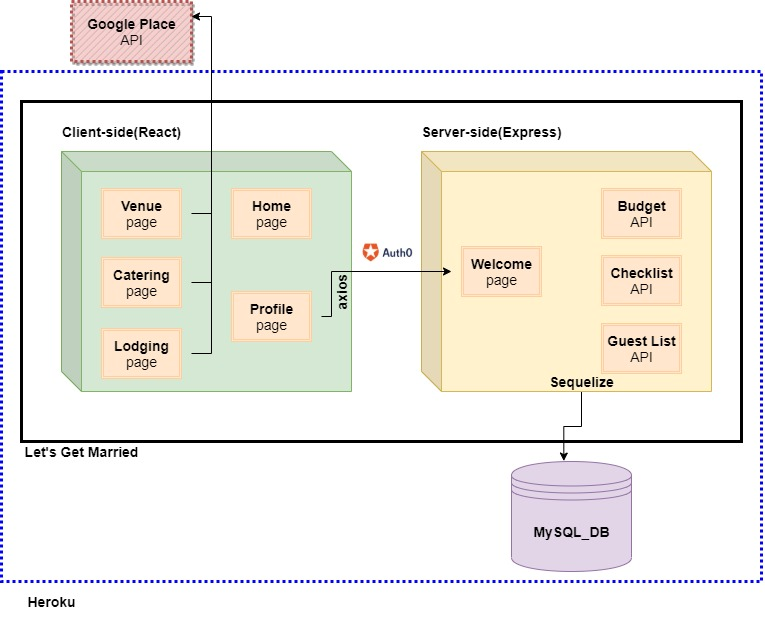

# Lets-Get-Married

<p align="center">
 
</p>

---

### Table of Contents

- [Project Description](#project-description)
- [Reference Links](#reference-links)
  - [Let's Get Married Application Live Link](https://)
  - [Let's Get Married Application GitHub Repo](https://github.com/EdenKhaos/Lets-Get-Married)
  - [Project Board](https://app.gitkraken.com/glo/board/X63pPA2DKwARKEOc)
- [User Story](#user-story)
- [Concept](#concept)
  - [Actions Diagram](#actions-diagram)
  - [Design](#design)
    - [Architecture](#architecture)
    - [Wireframes](#wireframes)
- [Application MVP](#application-mvp)
- [Installation Instructions](#installation-instructions)
  - [File Structure and Technologies Used](#file-structure-and-technologies)
  - [Core Node Dependencies](#core-node-depencencies)
- [Future Development](#future-development)
- [Team Members](#team-members)

---
## Project Description
A simple wedding planner app focusing on small or intimate weddings due to COVID-19, that is forcing many couples to scale down their big day!  .This application will keep couples be organized, on tasks and provide resources for small weddings on a budget. 

---
## Reference Links

Link to Let's Get Married Application deployed on Heroku - [Let's Get Married Application Live Link](https://)

Link to GitHub Repo used for application development - [Let's get Married Application GitHub Repo](https://github.com/EdenKhaos/Lets-Get-Married)

---
## User Story
```
Users can search for venues, lodging and cater options for their wedding.This will call an API that
will return an array of results.
Users can make an account to keep track of tasks, budget and guest lists, SO THAT they can be
organized. 
```
---
## Concept

This application is a full stack app that will allow an user to plan and manage their own wedding. The purpose of creating this application is to give a starting point to narrow down the important aspects of a small wedding and sticking to a strict list and budget. This should allow couples to plan their 'Big Day' with minimizing the need to cancel their plans due to COVID restrictions.

### Actions Diagram


 
 ### Design

 The overall design in this section will address how the application generally functions in it's entirety.
 
 ### Architecture
 This application was created with MVC (model-view-control) as the basis of design. This type of organization allows the application to have a front-end user interaction separate from the back-end logistic functionality. Below diagrams shows the building blocks of this application's creation.

 ### MVC
 <details>
  <summary>Click to expand!</summary>
  
  <p>MVC</p>
  
  
  </details>

  ### Wireframes
  <details>
  <summary>Click to expand!</summary>
  
  <p>Wireframes</p>
  
  
  </details>

---
## Application MVP

- The user can **register** and **login**.
- The user can see his/her **profile**.
- The user can list, create, and edit the API **lists** once registered.
- The user can **search venues**, **search catering**, **search lodging** using the **Google Places/Maps**.
- The user can **logout** .
---
## Installation Instructions
In order to successfully develop and launch this assignment, the following items must be installed and/or accessible from your working environment (i.e. laptop, computer, etc.).

- **Node.js** - Make sure Node.js is installed in your machine. If Node.js is not installed on your machine, [click here](https://nodejs.org/en/) to download the application.
- **Node Modules** - This project used various `node modules`, which are listed in the package.json files listed in both the `client folder` and `main root folder` of this application. A screenshot of dependencies listed in each package.json file are listed included below. Please run `npm install` or in your terminal to install all required node modules.

Once all dependencies are installed run `npm run start` to start the application locally. 

#### Package.json file in Root Directory

<details>
  <summary>Click to expand!</summary>
  
  <p>Package.json file in Root Directory</p>
  
  
</details>

#### Package.json in Client Folder

<details>
  <summary>Click to expand!</summary>
  
  <p>Package.json in Client Folder</p>
  
  
</details>

---
### File Structure and Technologies Used

- Model-View-Controller (**MVC**) framework as an architectural pattern
  <details>
    <summary>Click to expand!</summary>
    <p>MVC folder pattern for this project</p>
    

  </details>

- Node.js
- React.js
- Mongoose DB
- Axios
- Google Maps API
- Google Places API
- Google Geolocation API
- React-Bootstrap
- User Authentication using app.js and UserContext.js
---
### Core Node Dependencies
The dependencies listed below are all the `NPM packages` used throughout this project.

- axios
- bcryptjs
- cors
- dotenv
- express
- passport
- react-router-dom
- date-fn
- @reach/combobox
- @react-google-maps/api
- use-places-autocomplete

---
## Future Development

For `future` development, we would like to incorporate the following feature `enhancements` into our web application:

- 
- 
- 

---

## Team Members

- [Heather Cooper](https://github.com/EdenKhaos)
- [Hannah Jorich](https://github.com/hannahjorich)
- [Aman Chaudhry](https://github.com/Amanherach)
- [Lisa Van Huijkelom](https://github.com/lvv5040)

---

[Table of Contents](#table-of-contents)
